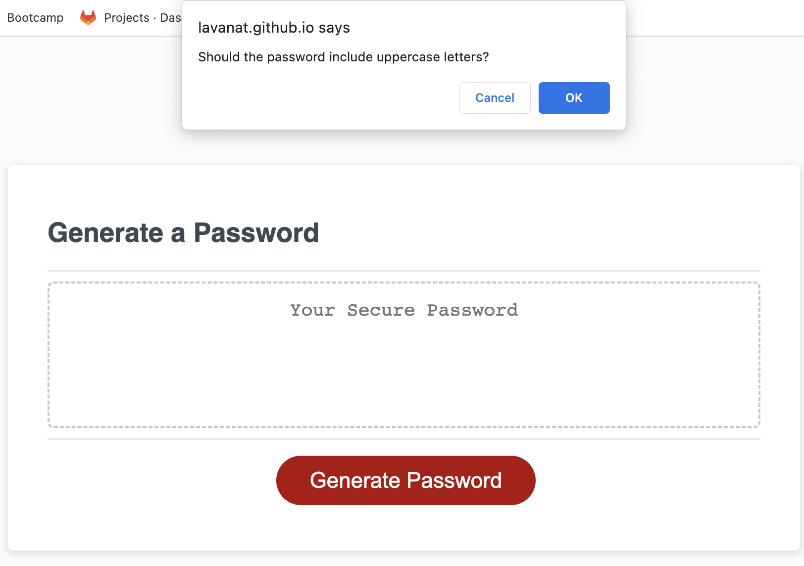

# password-generator
Generates a password based on user-selected criteria

## Description

This page generates a password based on four, user-selected criteria. The options are: lowercase letters, uppercase letters, numbers, and special characters. The user also then selects a password length between 8 and 128. The program then returns a randomly generated password.

## Usage

You can use this page to randomly generate a password.

## Link to Deployed Application

https://lavanat.github.io/password-generator/

## Screenshot of Deployed Application

## License

Refer to the License file in the repo.
